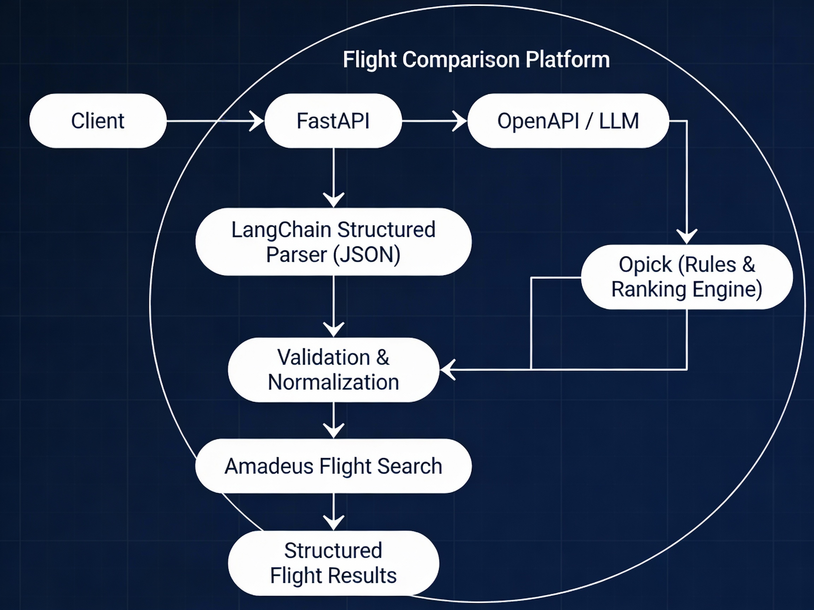

**V2 – Flight Comparison Model**

A **deterministic, production-ready flight comparison API** built with **FastAPI** , **LangChain structured output** , **OpenAI** , and **Amadeus Flight Search** , with **Opik observability** for tracing and evaluation .

**Overview**

**V2- Flight Comparison** converts natural-language flight requests into structured search parameters using **LLM-powered parsing** , queries the **Amadeus Flight Search API** for real flight offers, and returns **ranked, normalized flight results** .

**Key Characteristics**

- **FastAPI** REST API
- **LangChain** used as a _thin wrapper_ (Runnable + structured output)
- **OpenAI** for natural-language → structured query parsing
- **Amadeus, Flight Search API**
- **Opik** for tracing, logging, and evaluation
- Deterministic validation & normalization
- Ranked flight results (price ascending)
- Clean, structured response schema
- Evaluation-friendly & production-ready

**_Architecture_**

**Dependencies**

All dependencies are listed in requirements.txt.

Install them with:

pip install -r requirements.txt

**Project Structure**

**Configuration**

Environment Variables (.env)

OPENAI_API_KEY=your_openai_key

AMADEUS_API_KEY=your_amadeus_key

AMADEUS_API_SECRET=your_amadeus_secret

**Settings Loader**

settings.py uses pydantic.BaseSettings to automatically load and validate environment variables.

**LLM Query Parsing**

The system uses **LangChain** with **structured output schemas** to extract flight parameters from natural-language queries.

LangChain is used as a **abstraction layer** :

- Runnable execution
- JSON, schema-validated output

**Amadeus Flight Search**

- Uses Amadeus **sandbox API**
- OAuth2 client credentials flow
- Fetches flight offers for the requested route and date
- Raw Amadeus responses are normalized into a clean internal schema

**Core Logic – flight_service.py**

flight_service.py is the heart of the system:

- Parses user queries using the LLM parser
- Validates and normalizes dates
- Guards against past dates (auto-shifts to future)
- Queries Amadeus Flight Search API
- Normalizes flight offers
- Ranks flights by **price (ascending)**
- Returns the **top N cheapest flights** (configurable)

**Ranking Logic**

- Flights are sorted by **total price (ascending)**
- Only the **cheapest N offers** are returned
- Default behavior can be easily adjusted in flight_service.py

**API Entrypoint**

**Start the Server**

uvicorn app.main:app --reload

**Endpoint**

POST /search

**Request Body**

{

"query": "Find cheap flights from San Francisco to Paris next Friday"

}

**Example curl Command or run (python tests/request_test.py)**

curl -X POST http://localhost:8000/search \

-H "Content-Type: application/json" \

-d '{"query": "Find cheap flights from San Francisco to Paris next Friday"}'

**Example Response**

Below are the **top 3 cheapest flights** responses :

**Observability & Evaluation**

**Opik Integration**

The project integrates **Opik** for:

- Request tracing
- LLM input/output logging
- Latency measurement
- Evaluation hooks for future experiments

This ensures:

- Full transparency of LLM behavior
- Easy debugging
- Production-grade monitoring

**Testing**

**Basic API tests are located in:**

tests/request_test.py

Run tests with:

python tests/request_test.py

**Summary**

This project demonstrates a **clean, deterministic LLM-powered API** with:

- Explicit control flow
- Structured outputs
- Real external data (Amadeus)
- Observability baked in
- Production-ready design

Ideal for:

- LLM evaluation
- Retrieval + ranking pipelines
- Real-world API deployments
