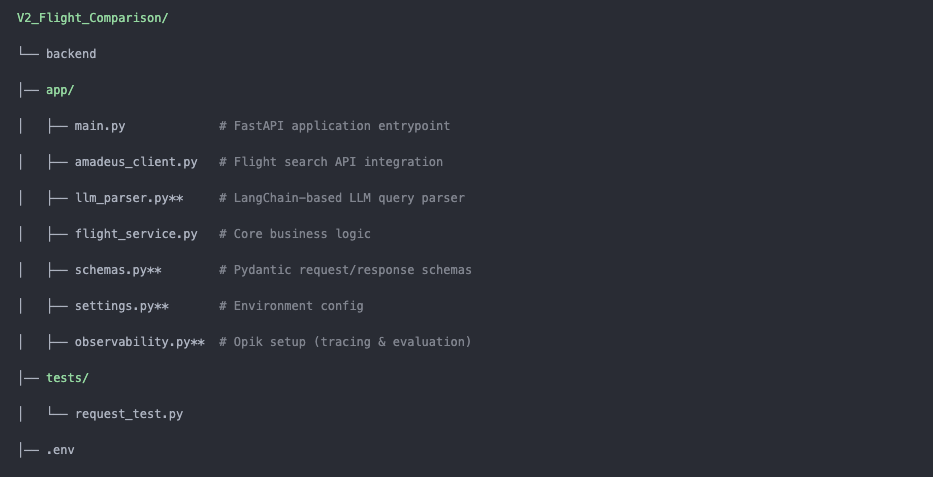
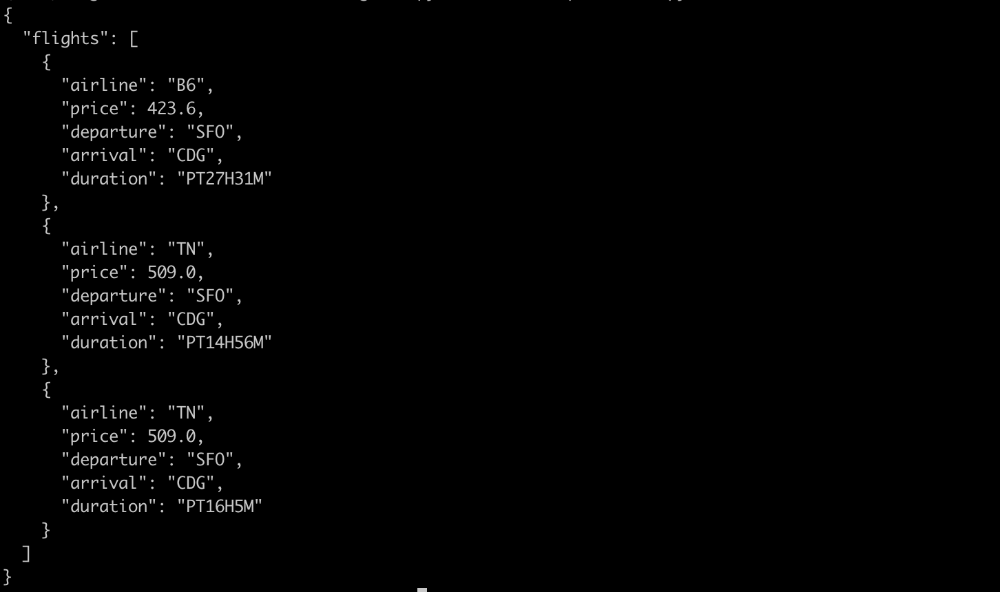

## Quick Links
- [Overview](#overview)
- [Features](#features)
- [Key Characteristics](#key-characteristics)
- [Installation](#installation)
- [Project Structure](#project-structure)
- [Configuration](#configuration)
- [Example Response](#example-response)
- [Observability and Evaluation](#observability-and-evaluation)
- [Future Improvements](#future-improvements)
- [License](#license)
  
## Overview📖

The Flight Comparison API is a production-ready service that transforms natural language queries into structured flight searches.

Built with FastAPI and powered by LLM-based parsing, the system interprets user requests (e.g., “Find me the cheapest flight from NYC to London next week”), converts them into precise search parameters, and retrieves real-time flight offers from the Amadeus API.

Results are normalized, ranked, and returned in a clean, developer-friendly format. The system also includes observability and tracing to monitor performance and ensure reliability.

## Features✨

🔍 Search for available flights  
⚖️ Compare multiple flight options  
⚡ Fast and user-friendly interface  
📊 Clear and organized results  

## Key Characteristics ⚙️

- REST API built with FastAPI for high performance and scalability
- Natural language processing powered by OpenAI
- LangChain used for structured orchestration (Runnable + output parsing)
- Integration with Amadeus Flight Search API for live data
- Opik used for observability, tracing, and evaluation
- Deterministic validation pipeline ensures reliable outputs
- Flight results ranked by price (ascending order)
- Structured response schema designed for API consumers
- Built with production readiness and testing in mind
  

**_Architecture_**

## Installation📦

Clone the repository:

git clone https://github.com/negash/V2_Flight_Comparison.git  
cd V2_Flight_Comparison

Install dependencies:

pip install -r requirements.txt

## Project Structure📁

## Configuration⚙️

This project requires environment variables to run correctly.

## Environment Variables ('.env')📁

Create a '.env' file in the project root and add the following:

OPENAI_API_KEY=your_openai_key 
AMADEUS_API_KEY=your_amadeus_key 
AMADEUS_API_SECRET=your_amadeus_secret

## Settings Loader

settings.py uses pydantic.BaseSettings to automatically load and validate environment variables.

## LLM Query Parsing

The system uses **LangChain** with **structured output schemas** to extract flight parameters from natural-language queries.

LangChain is used as a abstraction layer:

- Runnable execution
- JSON, schema-validated output

## Amadeus Flight Search

- Uses Amadeus sandbox API
- OAuth2 client credentials flow
- Fetches flight offers for the requested route and date
- Raw Amadeus responses are normalized into a clean internal schema

## Core Logic – flight_service.py

flight_service.py is the heart of the system:

- Parses user queries using the LLM parser
- Validates and normalizes dates
- Guards against past dates (auto-shifts to future)
- Queries Amadeus Flight Search API
- Normalizes flight offers
- Ranks flights by price (ascending)
- Returns the top N cheapest flights (configurable)

## Ranking Logic

- Flights are sorted by **total price (ascending)**
- Only the **cheapest N offers** are returned
- Default behavior can be easily adjusted in flight_service.py

## API Entrypoint

## Start the Server

uvicorn app.main:app --reload

## Endpoint

POST /search

## Request Body

{

"query": "Find cheap flights from San Francisco to Paris next Friday"

}

## Example curl Command or run (python tests/request_test.py)

curl -X POST http://localhost:8000/search \

-H "Content-Type: application/json" \

-d '{"query": "Find cheap flights from San Francisco to Paris next Friday"}'

## Example Response

Below are the **top 3 cheapest flights** responses :

## Observability & Evaluation

## Opik Integration

The project integrates **Opik** for:

- Request tracing
- LLM input/output logging
- Latency measurement
- Evaluation hooks for future experiments

This ensures:

- Full transparency of LLM behavior
- Easy debugging
- Production-grade monitoring

After initializing the server via uvicorn app.main:app --reload, you can monitor the latency breakdown between the LLM and the API. Detailed execution traces are available at the Opic URL provided in the console output. Alternatively, logs can be accessed directly through the Opic dashboard at comet.com

**Testing**

**Basic API tests are located in:**

tests/request_test.py

Run tests with:

python tests/request_test.py

**Summary**

This project demonstrates a **clean, deterministic LLM-powered API** with:

- Explicit control flow
- Structured outputs
- Real external data (Amadeus)
- Observability baked in
- Production-ready design

Ideal for:

- LLM evaluation
- Retrieval + ranking pipelines
- Real-world API deployments

 ## Future Improvements

- Add web-based interface  
- Mobile-friendly version  
- Advanced filtering and sorting  
- Save favorite flights 

## License

This project is licensed under the MIT License.
  
Copyright (c) 2026 Negash (https://github.com/negash)

## 👤 Author

Developed by Negash
